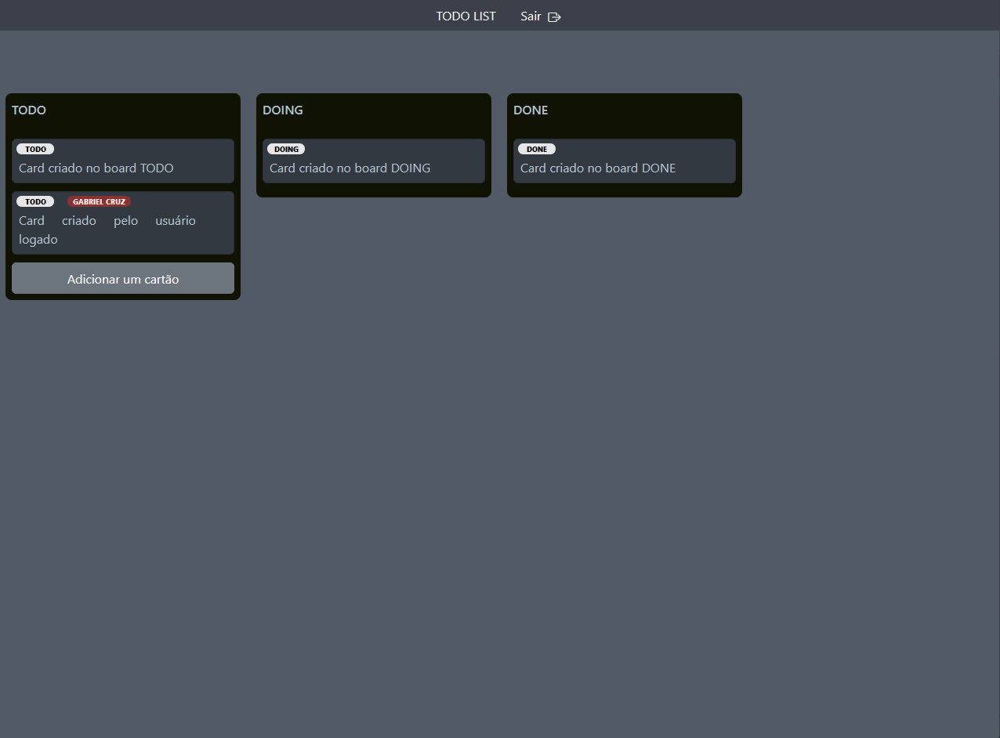
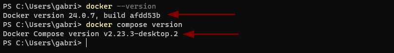
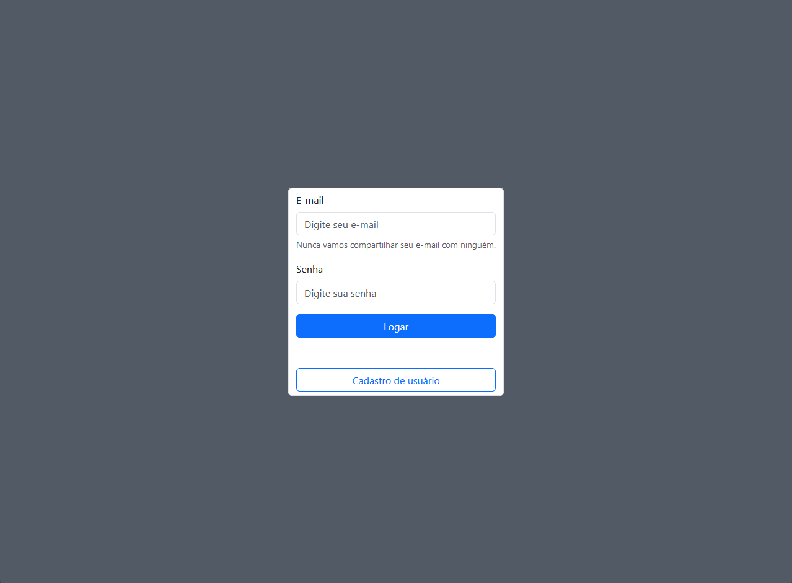
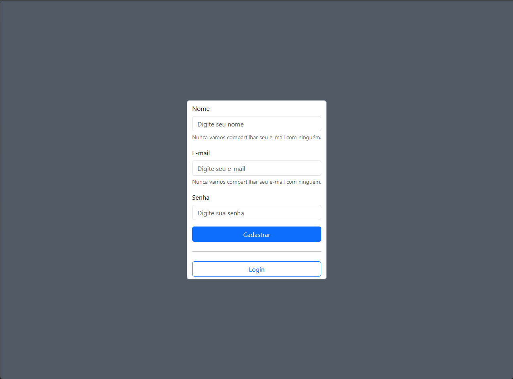
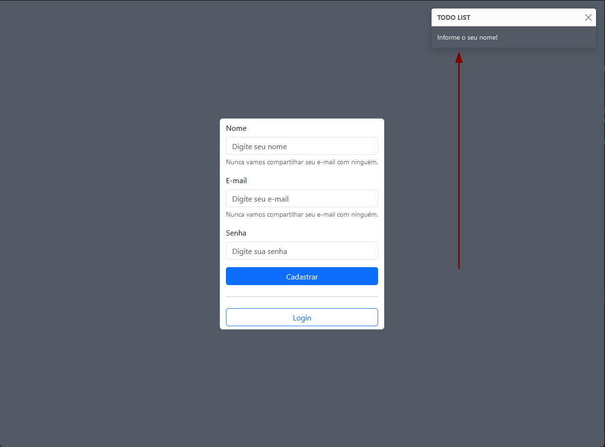

### Links úteis
[Como configurar o ambiente e executar o sistema](#como-configurar-o-ambiente-e-executar-o-sistema)

[Banco de dados](#a-estrutura-do-banco-de-dados-está-disposta-da-seguinte-forma)

[Telas do sistema](#abaixo-algumas-telas-do-sistema)

---

# TODO LIST

O TODO LIST é um sistema de gerenciamento de tarefas que visa proporcionar ao usuário uma forma simples de visualizar seu progresso em suas atividades cotidianas.

O usuário dispõe de três colunas TODO, DOING e DONE para acomodar cada tarefa de acordo com seu status.

---

<picture>
 
</picture>

---

Também é possível ter mais de um usuário logado no sistema, permitindo assim o gerenciamento de tarefas de um time.

O TODO LIST se limita a apenas essas funcionalidades:

- Criação/Edição/Exclusão de cartões que simbolizam tarefas a serem realizadas
  - Para editar um cartão, clique duas vezes sobre o mesmo e uma caixa de edição será disponibilizada.
  - Para excluir um cartão, passe o mouse sobre o mesmo e um botão de exclusão será exibido, no mobile, basta clicar no canto superio direito do cartão.
- Possibilidade de mover os cartões entre as colunas de **TODO**, **DOING** e **DONE**.
  - Para arrastar um cartão, é necessário clicar e segurar nele, e em seguida arrastá-lo para a coluna desejada.
- Cadastro de usuários para acesso ao sistema e controle para que apenas esses usuários possam interagir com a ferramenta.
- Atualização em tempo real do quadro TODO LIST, todos os usuários logados podem acompanhar em tempo real o que os outros usuários estão fazendo.

---

## Como configurar o ambiente e executar o sistema

A estrutura do projeto foi pensada para facilitar ao máximo o setup do sistema. 

> Para que o sistema funcione corretamente, é necessário que o docker e o docker compose estejam instalados na sua máquina, pelo menos nas versões a seguir ou superiores:
> ```
> Docker version 24.0.7
> Docker Compose version v2.23.3-desktop.2
> ```


<picture>
 
</picture>

---

Na raiz do projeto existe o arquivo **sample.env**, você precisa renomeá-lo para apenas **.env** antes de executar o comando a seguir.


Também é necessário garantir que as seguintes portas do seu computador/servidor não estão sendo usadas por outros containers:
   - **9000**
   - **80**
   - **8080**
   - **8081**

Para que o servidor websocket funcione também no mobile, é necessário sua intervenção, uma vez que o sistema vai ser executado na sua máquina, o seu celular precisa estar conectado à mesma rede do computador
e o endereço configurado na variável ```socketUrl``` do arquivo ```www/public/assets/js/WebSocketClient.js``` precisa ser ajustado para o endereço IP local da sua máquina.  


Após seguir os passos anteriores, navegue pelo terminal até a raiz do projeto e execute o seguinte comando:
```
docker compose up -d --force-recreate   
```

Aguarde um ou dois minutos para que o sistema consiga instalar as depedências do projeto, se tudo ocorrer bem, o sistema deve estar operante na seguinte url: [TODO LIST (localhost)](http://localhost/).

O projeto já executa automaticamente o comando: ``` composer install ```, isso faz com que a aplicação demore mais ou menos um dois para ficar pronta para execução, a depender da sua conexão com a internet.

Esse processo foi feito para facilitar o uso, entretanto, requer acompanhamento. Caso o sistema não consiga instalar as dependências com sucesso, por gentileza execute o comando abaixo no seu terminal:

```
docker exec todo_list_app bash -c  "export XDEBUG_MODE=off && composer install --ignore-platform-reqs" bash
```

Outro problema que pode acontecer é o sistema não conseguir ajustar corretamente a permissão de execução do arquivo  ```www/docs/scripts/bash/websocket_server.sh```. Caso isso ocorra, por gentileza execute o seguinte comando:

```
docker exec todo_list_app bash -c  "chmod +x /usr/share/nginx/html/docs/scripts/bash/websocket_server.sh" bash
```
Pronto! O TODO LIST está pronto para uso.


## A estrutura do banco de dados está disposta da seguinte forma:


| Tabela | colunas                                                                           |
|-------:|-----------------------------------------------------------------------------------|
|  board | id, name, created_at, updated_at, deleted_at                                      |
|   card | id, user_id, board_id, description, position,  created_at, updated_at, deleted_at |
|   user | id, name, email, password, created_at, updated_at, deleted_at                     |


### Abaixo podemos ver o script de criação do banco de dados:

``` 
DROP DATABASE IF EXISTS todolist;

CREATE DATABASE IF NOT EXISTS todolist CHARACTER SET utf8mb4 COLLATE utf8mb4_0900_ai_ci;

USE todolist;

CREATE TABLE IF NOT EXISTS user
(
    id         INT(10) unsigned NOT NULL auto_increment,
    name       VARCHAR(45)      NOT NULL,
    email      VARCHAR(80)      NOT NULL,
    password   VARCHAR(255)     NOT NULL,
    created_at DATETIME         NOT NULL DEFAULT NOW(),
    updated_at DATETIME         NOT NULL DEFAULT NOW(),
    deleted_at DATETIME,
    PRIMARY KEY (id),
    CONSTRAINT user_unique_pk unique (email)
);

CREATE TABLE IF NOT EXISTS board
(
    id         INT(10) UNSIGNED NOT NULL AUTO_INCREMENT,
    name       VARCHAR(50)            NOT NULL,
    created_at DATETIME DEFAULT NOW() NOT NULL,
    updated_at DATETIME DEFAULT CURRENT_TIMESTAMP NOT NULL,
    deleted_at DATETIME,
    CONSTRAINT id PRIMARY KEY (id)
);

CREATE TABLE IF NOT EXISTS card
(
    id           INT(10) UNSIGNED NOT NULL AUTO_INCREMENT,
    user_id      INT(10) UNSIGNED NULL,
    board_id     INT(10) UNSIGNED NOT NULL,
    description  VARCHAR(300) NOT NULL,
    position     INT(10) UNSIGNED NOT NULL,
    created_at   DATETIME DEFAULT NOW() NOT NULL,
    updated_at   DATETIME DEFAULT NOW() NOT NULL,
    deleted_at   DATETIME,
    CONSTRAINT id PRIMARY KEY (id),
    CONSTRAINT fk_card_board FOREIGN KEY (board_id) REFERENCES board (id) ON DELETE RESTRICT ON UPDATE RESTRICT,
    CONSTRAINT fk_card_user FOREIGN KEY (user_id) REFERENCES user (id) ON DELETE RESTRICT ON UPDATE RESTRICT
);

CREATE INDEX fk_board_id_idx ON card (board_id);

INSERT INTO board (name) VALUES ('TODO'), ('DOING'), ('DONE');
INSERT INTO card (description, position, board_id) VALUES ('Card criado no board TODO', 100, 1), ('Card criado no board DOING', 100, 2), ('Card criado no board DONE', 100, 3);
```


## Abaixo algumas telas do sistema:

### Tela de Login

---

<picture>
 
</picture>

---

### Tela de Cadastro

---

<picture>
 
</picture>

---

### Notificações

---

<picture>
 
</picture>

---

